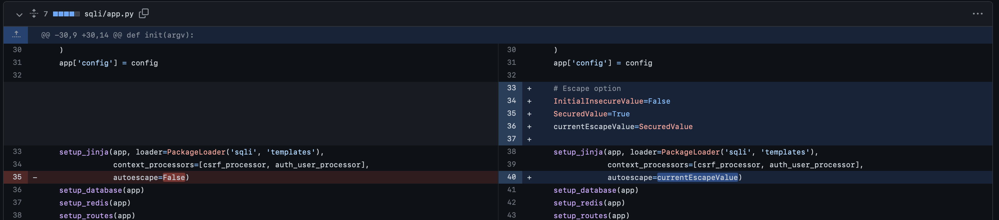
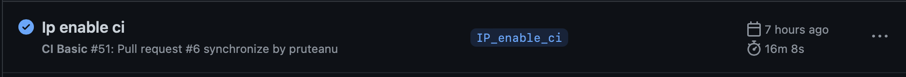
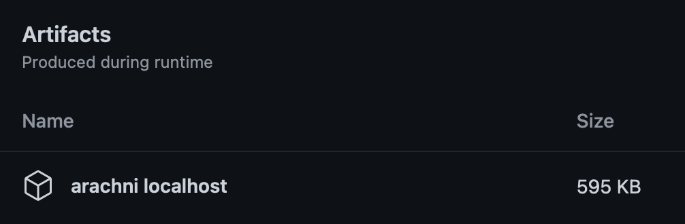
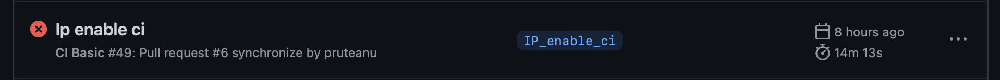

# ci-github-actions-demo

# Step 1: Fork a given repo into your own workspace
In this demo, I picked the well-known [DVPWA github repo](https://github.com/anxolerd/dvpwa). I created my fork, which is reachable as [`pruteanu/dvpwa_ip_demo`](https://github.com/pruteanu/dvpwa_ip_demo?organization=pruteanu&organization=pruteanu).

# Step 2: Clone the code into your own local env
After having your clone within your env:
```
git clone git@github.com:pruteanu/dvpwa_ip_demo.git
```
create a new branch(for me it was `IP_enable_ci`) using:
```
git checkout -b  IP_enable_ci
```
in the root dir of your clone fork, where the hidden `./.git` directory resides. 

# Step 3: 
Let's start with a simple commit. In the file: `.\sqli\app.py`, replace the initial approach of configuring the Jinja2 templating engine, which directly uses boolean values(e.g. `False`) for the `autoescape` parameter:
```
    setup_jinja(app, loader=PackageLoader('sqli', 'templates'),
                context_processors=[csrf_processor, auth_user_processor],
                autoescape=False)
```
with an approach more clear about the insecure vs the secure option:
```
    # Escape option
    InitialInsecureValue=False
    SecuredValue=True
    currentEscapeValue=SecuredValue

    setup_jinja(app, loader=PackageLoader('sqli', 'templates'),
                context_processors=[csrf_processor, auth_user_processor],
                autoescape=currentEscapeValue)

```
similarly with what's shown here: 

## Note
For this step, the `currentEscapeValue` must use the secure option, respectively `True`, as we want the Jinja template to escape the content, thus preventing a potential XSS `currentEscapeValue=SecuredValue` .

#Step 4
Copy it from current repo(under `./files`) or create the following hierarchy on the root dir of your fork repo:
```
mkdir -p .github/workflows
touch integrate.yml
```

and dump the following YAML content within the `integrate.yml` file :
```
name: CI Basic
on:
  pull_request:
    branches: [master]

jobs:
  test_pull_request:
    runs-on: ubuntu-latest
    steps:
      - uses: actions/checkout@v2
      - name: Docker compose web app
        run: docker-compose -f docker-compose.yml up -d
      - name: Downloading Arachni archive
        uses: wei/wget@v1
        with:
          args: https://github.com/Arachni/arachni/releases/download/v1.6.1.1/arachni-1.6.1.1-0.6.1.1-linux-x86_64.tar.gz
      - name: Scanning localhost-deployed web app with Arachni
        run: |
              tar -xvf arachni-1.6.1.1-0.6.1.1-linux-x86_64.tar.gz > /dev/null
              cd arachni-1.6.1.1-0.6.1.1/
              CURR_HOSTNAME=$(cat /etc/hostname)
              mkdir "./reports"
              ./bin/arachni http://${CURR_HOSTNAME}:8080/courses/1/review  --checks 'xss*' --report-save-path './reports' 2>&1 > ./reports/arachni_scan_stdout_stderr.txt
              scan_status=$(grep -oP "With issues: ([0-9]*)" ./reports/arachni_scan_stdout_stderr.txt | cut -d: -f2 | xargs)
              grep -A1 -B1 "Without issues" ./reports/arachni_scan_stdout_stderr.txt
              echo "Based on the above summarised output of the arachni scan, the identified status is: '$scan_status'! For more details, please open the .txt file in the job artifacts..."
              exit $scan_status
      - name: Archive report artifacts
        uses: actions/upload-artifact@v3
        with:
          name: arachni localhost
          path: arachni-1.6.1.1-0.6.1.1/reports
```

# Step5
Create a pull request in order to merge your secondary branch(e.g. IP_enable_CI) into your own `master` branch. Please be careful, as this being a fork, Github does a smart thing, first assuming you want to merge your branch into the original project([`anxolerd/dvpwa`](https://github.com/anxolerd/dvpwa)).

# Step6
In the `Actions` tab of your own forked repo, you should see that the CI workflow passes the XSS scan I configured using [Arachni](https://www.arachni-scanner.com). 

In the artifacts section, both the .ARF(Arachni Framework Report) and the .TXT file which has the stdout+stderr of my scanning attempt are present, the last one can be easily opened for reading more details.


# Step7
Go to the `.\sqli\app.py` used at step 3 and change the Jinja autoescape option to the `False` value, which is defined there via the self-explanatory variable `InitialInsecureValue`:
```
    currentEscapeValue=InitialInsecureValue
```
Commit your changes and go to the `Actions` tab again, the pipeline should fail. 


# Step8
Revert the last commit or change again to the secure value used at step3:
```
    currentEscapeValue=SecuredValue
```
Now the workflow should be good.

# Step 9 Enjoy the automation benefits
If this would have been a proper web-app and if its testing would have been more extensive(I've deliberately restricted scanning only to the XSS Arachni checks: `--checks 'xss*' ` for the sake of this demo), now would be time for a safe Blue/Green deployment in AWS, right?

# Lessons learned? 
Haha, using a local `debugger` which emulates the exact workflow locally. [Act](https://github.com/nektos/act) should satisfy my needs, but I didn't have enough time to debug why it shows nothing when I do:
```
% cd dvpwa_ip_demo 
% act -l
ID  Stage  Name  
% dvpwa_ip_demo % 
```

At the end of the day, when you're writing a Dockerfile, the builds are done locally first, not on the remote registry. Faster feedback is useful, but from Git's POV, in order to get rid of numerous, debugging-like remote attempts, one can use a plain, fast-forwarded merge.

